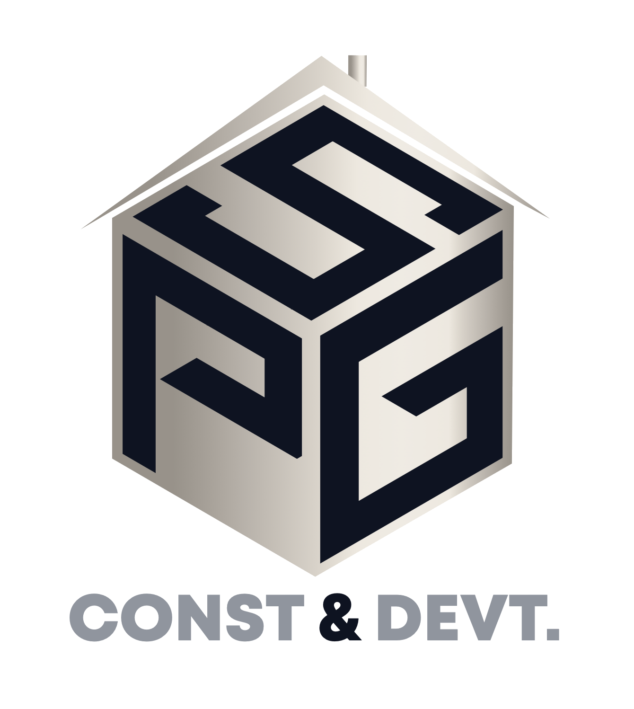

# Silverpack Group Construction Website

A modern, responsive construction company website built with Next.js, featuring architectural blueprint aesthetics, dynamic animations, and a sophisticated navy blue and silver color scheme.



## Features

- **Architectural Blueprint Design** - Unique blueprint-inspired UI elements throughout the site
- **Light/Dark Mode** - Elegant theme switching with custom navy and silver color palettes
- **Responsive Layout** - Mobile-first design that scales seamlessly to larger screens
- **Motion Animations** - Smooth transitions and interactive elements powered by Framer Motion
- **Modern UI Components** - Built with shadcn/ui component library for consistent styling
- **Contact Form** - Integrated contact form for client inquiries

## Tech Stack

- **Framework**: Next.js 
- **Styling**: Tailwind CSS
- **Animations**: Framer Motion
- **UI Components**: shadcn/ui
- **Typography**: Geist Sans + Mono, Playfair Display
- **Deployment**: [Your deployment platform]

## Getting Started

### Prerequisites

- Node.js 16.x or later
- npm or yarn

### Installation

1. Clone the repository
```bash
git clone https://github.com/yourusername/silverpack-construction.git
cd silverpack-construction
```

2. Install dependencies
```bash
npm install
# or
yarn install
```

3. Run the development server
```bash
npm run dev
# or
yarn dev
```

4. Open [http://localhost:3000](http://localhost:3000) in your browser

## Project Structure

```
├── public/            # Static assets
│   ├── clients/       # Client logos
│   ├── documents/     # Downloadable documents
│   └── silverpack.png # Company logo
├── src/
│   ├── app/           # Next.js app directory
│   │   ├── services/  # Service pages
│   │   └── globals.css # Global styles
│   ├── components/    # React components
│   │   ├── layout/    # Layout components (Header, Footer, etc.)
│   │   └── ui/        # UI components
│   └── lib/           # Utility functions
├── tailwind.config.js # Tailwind configuration
└── components.json    # shadcn/ui configuration
```

## Contributing

1. Fork the repository
2. Create your feature branch (`git checkout -b feature/amazing-feature`)
3. Commit your changes (`git commit -m 'Add some amazing feature'`)
4. Push to the branch (`git push origin feature/amazing-feature`)
5. Open a Pull Request
